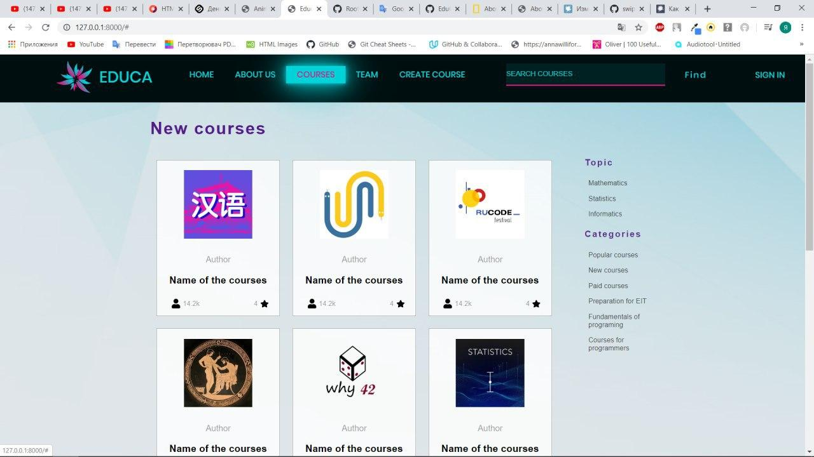
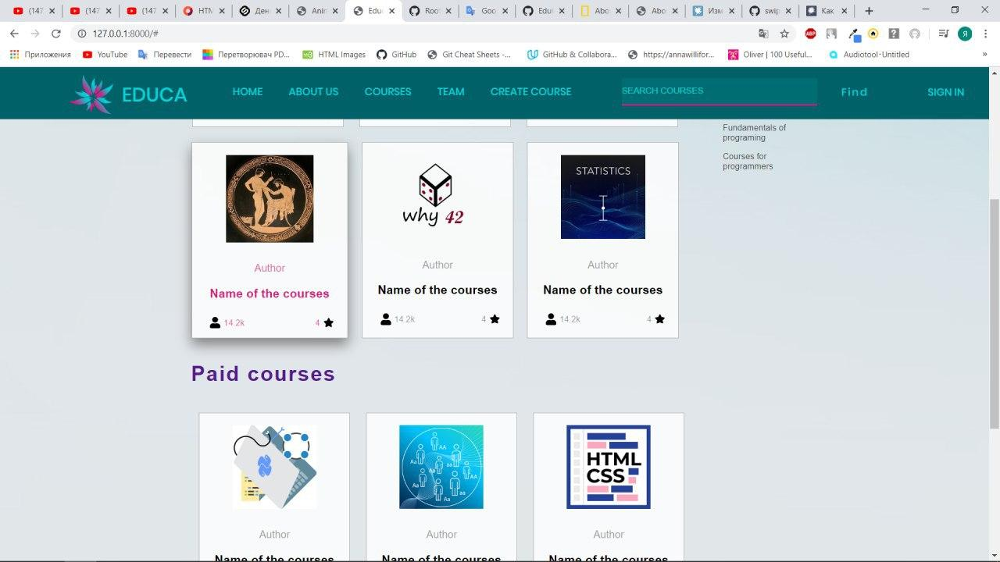
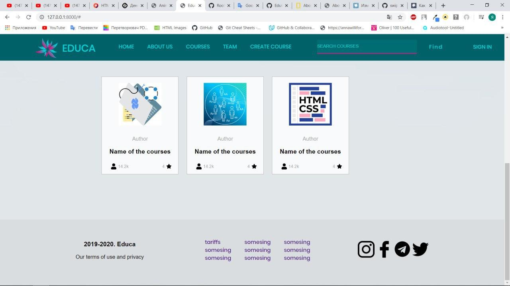
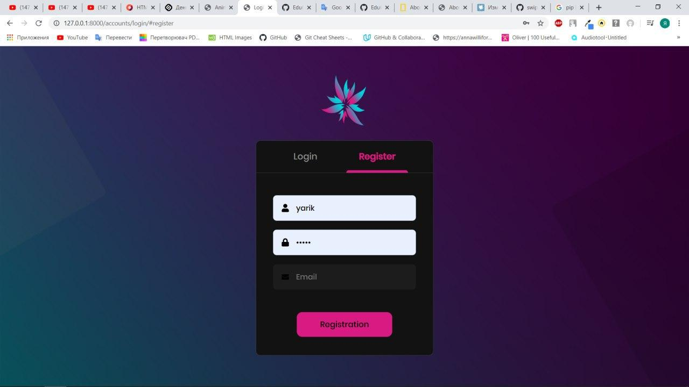
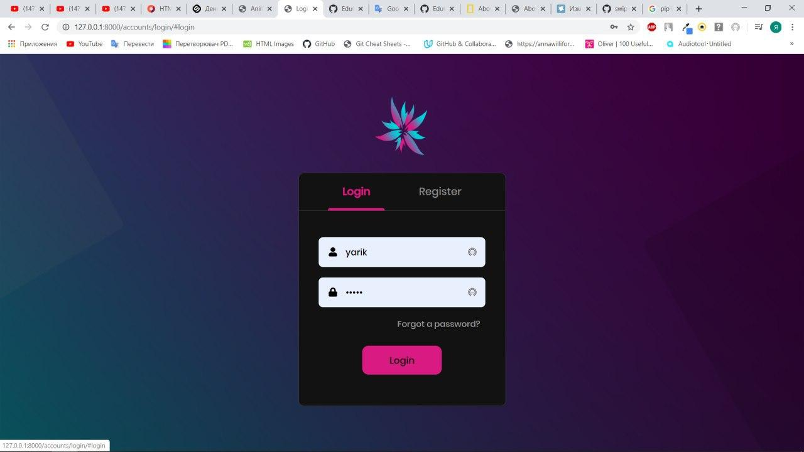
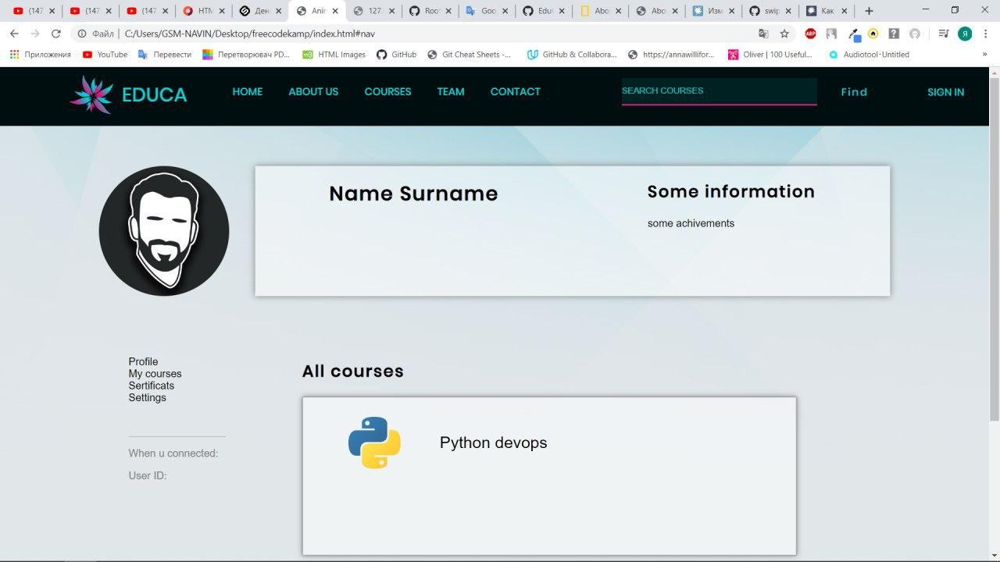
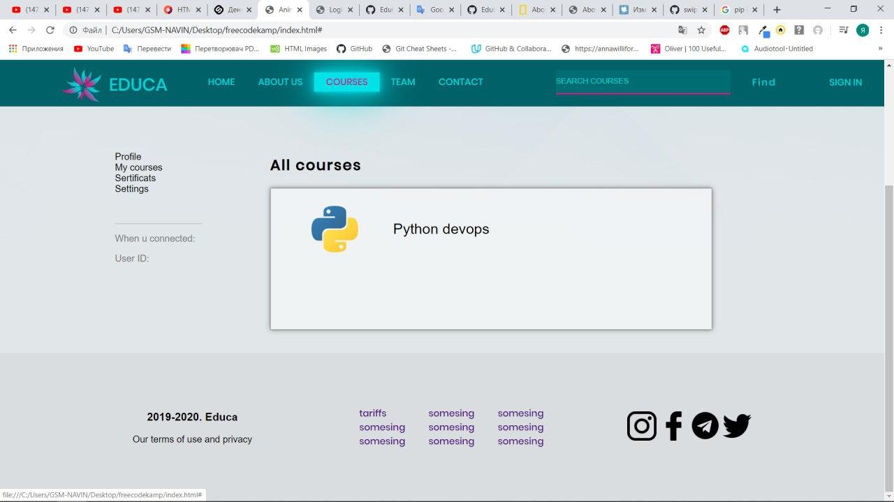

# EduCation
  
Educa is ukrainian educational platform and constructor of free open online courses and lessons.  
## Review  
Educa main page displays the list of all cources the user can pass.  
  
  

The registration/logining page:  

  
The profile page of the registered user:  
  
The list of the user's passed cources page:  
  
